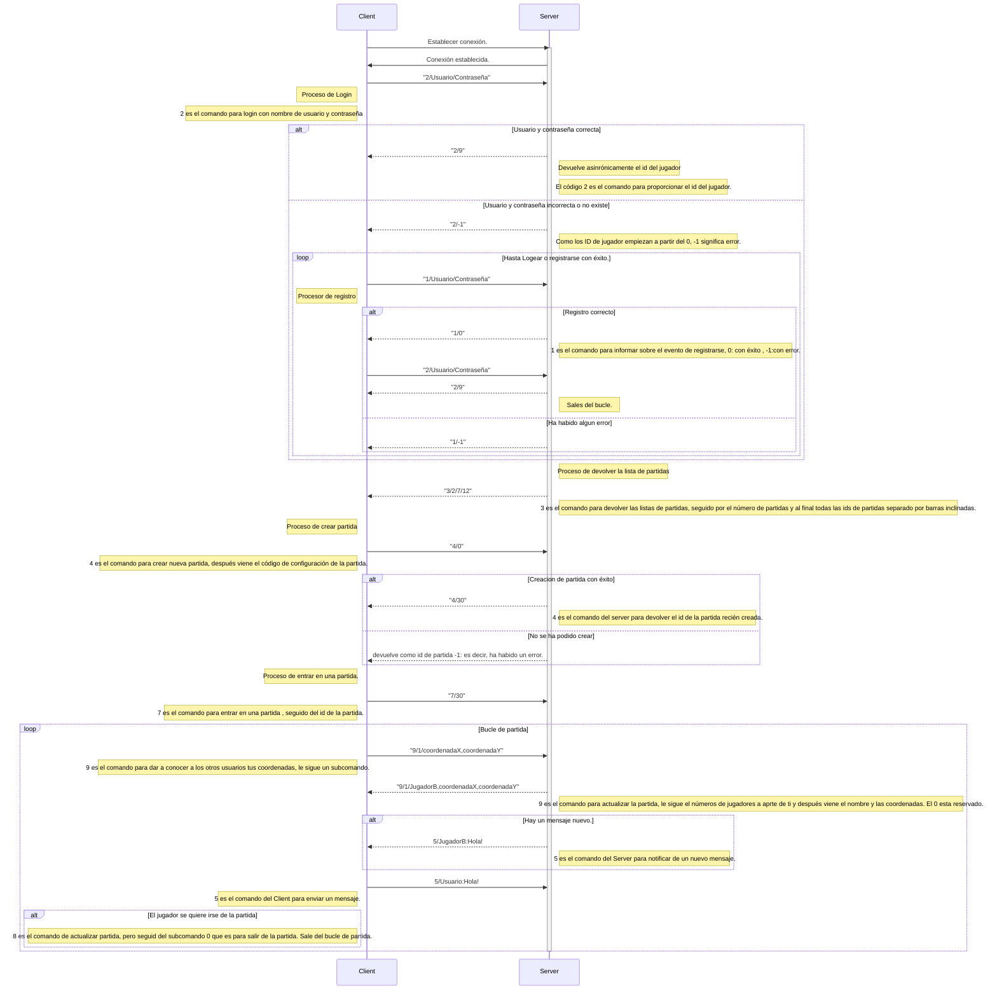

# Proyecto-T3-SO-2024
Proyecto del grupo T3

Version v5-dev generado por Wenjie C.

----
# Protocolo de la aplicación.

Dependiendo si estamos en el cliente o en el servidor los parámetros de cada comando van a variar.

## Registrar

Empieza con el comando 1.

## Login

Empieza con el comando 2:

### En el cliente

`2/Usuario/Contraseña`

Enviado después de dar click al botón de login.

+ El primer parámetro es el nombre del usuario.
+ El segundo parámetro es la contraseña vinculada al usuario.

### En el server

`2/9`

Respuesta a la petición de login del cliente.

+ El único parámetro indica el id del jugador. Si no existe el usuario o la contraseña es incorrecta entonces devuelve -1.

## Listar partidas

Empieza con el comando 3:

### En el cliente

`3/`

Enviado después de dar click en el botón de Play.

### En el server

`3/2/7/12`

Respuesta a la petición de listar partidas del cliente.

+ El primer parámetro indica la cantidad de partidas que tiene el jugador (o disponible para todos?).
+ Los siguientes parámetro depende del primer parámetro ya que son los ids de las partidas.

## Nueva partida

Empieza con el comando 4:

### En el cliente

`4/0`

Enviado después de dar click en el botón de nueva partida.

+ El primer parámetro indica la configuración de partida, pero no se me ocurre nada de momento.

### En el server

`4/30`

Respuesta a la petición de crear nueva partida.

+ El único parámetro es el id de la partida.

## Enviar mensaje

Empieza con el comando 5:

### En el cliente

`5/Usuario:Hola!`

Enviado después de que el usuario tecle ENTER.

+ El único parámetro es el nombre del jugador seguido por el mensaje y separado por dos puntos.

### En el server

`5/Uusario2:Hola!`

Cuando otro usuario envía un mensaje.

## Unirse en la partida.

Empieza con el comando 6:

### En el cliente

`6/id_partida`

Después de dar click en el botón al seleccionar una partida de la lista.

+ El único parámetro es el id de la partida.

### En el server

`6/0`

+ El primer campo indica si se ha unido a la partida con éxito o no.

## Unirse en una partida creada por otro jugador.

Empieza con el comando 7:

### En el cliente

`7/id_partida`

Después de dar click en aceptar.

+ El primer campo indica a la partida que quieres unirte

### En el server

`7/0`

Después de que el otro usuario haya aceptado.

+ El primer campo indica si el otro usuario ha aceptado o no.

## Notificar que hay un jugador que se quiere unir a tu partida.

Empieza con el comando 8:

### En el server

`8/id_jugador`

Después de recibir la petición de ser invitado de otro jugador.

+ El único campo corresponde al id del otro jugador.

### En el cliente

`8/0`

Después de aceptar o denegar al dialogo.

+ El único campo indica si el jugador ha aceptado (0) o no (-1) 

## Actualización de jugadores en la partida.

Empieza con el comando 9 :

### En el cliente

`9/<id_del_jugador>:<coordenada_X>;<coordenada_Y>`

Por cada ciclo del juego.

+ El parámetro principal es el nombre del jugador, dos puntos y sus coordenadas.
+ Pueden haber otros parámetros opcionales.

### En el server

``9/<id_del_jugador>:<coordenada_X>;<coordenada_Y>``

Redireccion de las peticiones de los jugadores.

